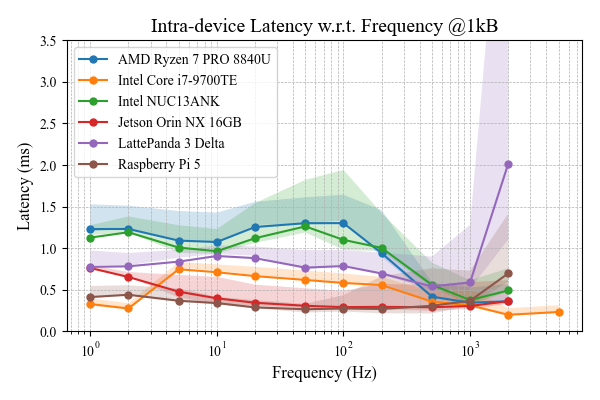
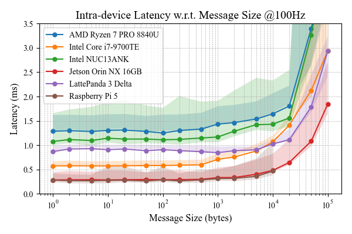
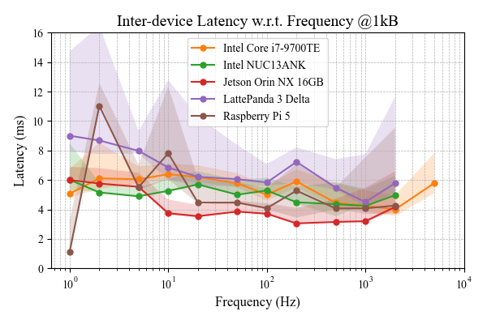
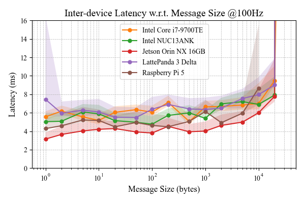
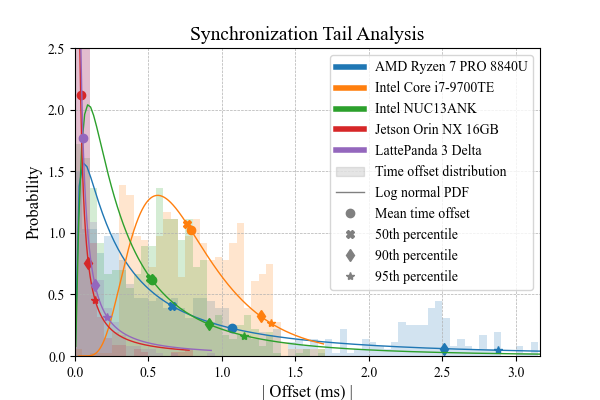
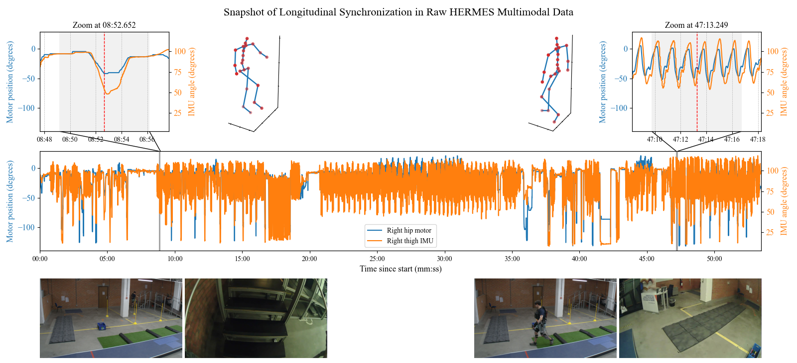
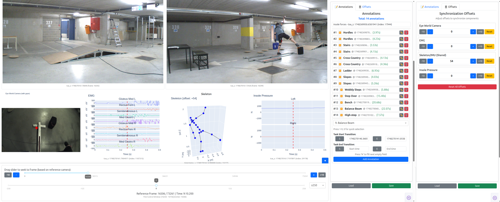

# HERMES Benchmarks

Principal evaluation benchmarks for [HERMES](https://github.com/maximyudayev/hermes).

<!-- TODO: suggest using UV -->
## Installation
Create a Python 3 virtual environment `python -m venv .venv` (python >= 3.7).

Activate it with `.venv/bin/activate` for Linux or `.venv\Scripts\activate` for Windows.

Single-command install HERMES into your project along other dependendices. 
```bash
pip install -e .
```

### FFmpeg (Optional)
If dealing with video or audio, you will have to install [FFmpeg](https://ffmpeg.org/).

Make a copy of the `examples/video_codec_<type>.yml`, that matches your video encoding hardware (AMD or Intel CPU, or an NVIDIA GPU), as `examples/video_codec.yml`

#### Windows
1. Download the full build with shared libraries from [gyan.dev](https://www.gyan.dev/ffmpeg/builds/ffmpeg-release-full-shared.7z).
1. Unpack the archive into the desired folder, like `C:\Program Files\ffmpeg`.
1. Add path to the FFmpeg binaries to the `Path` environment variable manually, or via CMD. 
   ```powershell
   SETX PATH "%PATH%;C:\Program Files\ffmpeg\bin;C:\Program Files\ffmpeg" /M
   ```
1. Open a new terminal window and check that FFmpeg can be correctly found by the system `where ffmpeg`.

#### Linux
1. Install with the package manager `sudo apt-get install ffmpeg`.
1. Check that ffmpeg is on path `which ffmpeg`.

## Running

### Communication Latency
1. On each host device, run the latency evaluation automated script under `latency/`:
   ```bash
   cd test
   ```
   as `test_latency_localhost.bat` for Windows or `. test_latency_localhost.sh` for Linux.
1. Gather generated CSV files from all tested devices and place in `data/latency/localhost/<device_name>` subfolders in the following structure. The folder name will be used as the trace name of the corresponding series on the generated plot.
   ```bash
   root/
   └───data/
       └───latency/
           ├───localhost/
           │   ├───laptop/
           │   │   ├───byte_100/
           │   │   │   └───latency_vs_frequency.csv
           │   │   └───rate_10/
           │   │       └───latency_vs_msgsize.csv
           │   ├───nuc/
           │   ├───pi/
           │   └───server/
           └───multi_device/
   ```
1. Invert the directory structure for batch visualization by running `python utils\invert_latency_subfolders.py` for Windows or `python utils/invert_latency_subfolders.py` for Linux.
1. Visualize latencies by running `plot_latency.bat .\data\latency\localhost_inverted` for Windows or `. plot_latency.sh ./data/latency/localhost_inverted` for Linux. It will generate latencies for each device ran on the shared set of experimental parameters:

<p align="center">
  
  
</p>
<p align="center">
  
  
</p>

### Synchronization Consistency
1. Log the NTP offset over time on each device, under network and processing load by running (will spawn a background process):
   - **Windows** *(Option #1)* - Command Prompt
     ```cmd
     wmic process call create "cmd.exe /c w32tm /stripchart /computer:<local_ntp_server_ip> /samples:720 /period:5 /dataonly > %USERPROFILE%\Desktop\ntp_sync_1hr.log"
     ```
   - **Windows** *(Option #2)* - PowerShell
     ```powershell
     Invoke-CimMethod -ClassName Win32_Process -MethodName Create -Arguments @{CommandLine = 'cmd.exe /c w32tm /stripchart /computer:<local_ntp_server_ip> /samples:720 /period:5 /dataonly > %USERPROFILE%\Desktop\ntp_sync_1hr.log'}
     ```
   - **Linux** - bash
     ```bash
     nohup bash -c 'for i in {1..720}; do echo "=== $(date +"%Y-%m-%d %H:%M:%S") ===" >> ntp_sync_1hr.log; chronyc tracking >> ntp_sync_1hr.log; echo "" >> ntp_sync_1hr.log; sleep 5; done' > /dev/null 2>&1 &
     ```
     Then parse the log into a comma-separated file:
     ```bash
     echo "\n\n\n" > ntp_parsed.log; awk '/===/ { ts = $2 " " $3 } /System time/ { print ts ", " $4 "s" }' ntp_sync_1hr.log >> ntp_parsed.log
     ```
1. Gather generated log files from all tested devices and place in `test/data/ntp_sync`. The file name will be used as the trace name of the corresponding series on the generated plot. Ideally, use the same names as in [latency](#communication-latency), to match colors.
1. Run the plot generator script `plot_sync_tail.bat .\data\ntp_sync` on Windows or `. plot_sync_tail.sh ./data/ntp_sync` on Linux.

<p align="center">
  
</p>

### Longitudinal Data Alignment
1. Download [demo HERMES data](#longitudinal-data-alignment) [TBA] from a 4 device sensing setup:
    * Raspberry Pi 5 exoskeleton controller
    * LattePanda 3 Delta wearable companion (FPOV + gaze tracking)
    * Xsens MoCap system connected to a laptop
    * Camera PC with 4 high-resolution cameras
1. Update the `DATA_PATH` in the appropriate [Windows](test/synchronization/plot_sync_experiment.bat#L4) or [Linux](test/synchronization/plot_sync_experiment.sh#L5) CLI script to point to the downloaded data folder.
1. Run the plotting script and select the 2 points when prompted, to zoom-in on to visually validate synchronization in the raw longitudinal data:
   - **Windows** -> `test\synchronization\plot_sync_experiment.bat`
   - **Linux** -> `. test/synchronization/plot_sync_experiment.sh`

<p align="center">
  
</p>

## Data Annotation
<br>
<div align="center"></div>
<br>

We developed [PysioViz](https://github.com/maximyudayev/pysioviz) a complementary dashboard based on [Dash Plotly](https://dash.plotly.com/) for analysis and annotation of the collected multimodal data. We use it ourselves to generate ground truth labels for the AI training workflows. Check it out and leave feedback!

## License
This sourcecode is licensed under the MIT license - see the [LICENSE](https://github.com/maximyudayev/hermes/blob/main/LICENSE) file for details.

The project's logo is distributed under the CC BY-NC-ND 4.0 license  - see the [LOGO-LICENSE](https://github.com/maximyudayev/hermes/blob/main/LOGO_LICENSE.md).

## Citation
When using in your project, research, or product, please cite the following and notify us so we can update the index of success stories enabled by HERMES.

<a href="https://arxiv.org/abs/2601.12610" style="display:inline-block;">
  
</a>

```bibtex
@preprint{yudayev2026hermes,
   title={HERMES: A Unified Open-Source Framework for Realtime Multimodal Physiological Sensing, Edge AI, and Intervention in Closed-Loop Smart Healthcare Applications}, 
   author={Yudayev, Maxim and Carlon, Juha and Lamsal, Diwas and Stefanova, Vayalet and Filtjens, Benjamin},
   year={2026},
   eprint={2601.12610},
   archivePrefix={arXiv},
   primaryClass={eess.SY},
   doi={10.48550/arXiv.2601.12610}, 
}
```
